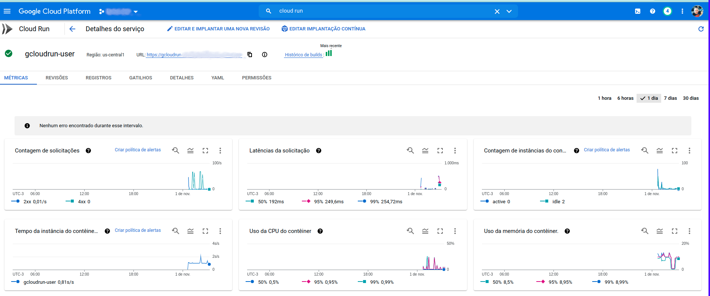

# gcloudrun User

Testando Google Cloud Run, testando com configurar e subir uma aplicação Go no serviço Cloud Run.
O objetivo é testar e levantar as possibilidades quando utilziamos este serviço.

Antes de iniciar lembra-lo que para fucionar precisaremos autenticar no google cloud com o seguinte comando.

O exemplo abaixo é fazendo push e build direto de sua máquina local e enviando para Registry.
Logo abaixo iremos fazer também utilizando Code Build + github.


## Registry + Docker

### Auth Login
```bash
$ gcloud auth login
```

### Artifacts Registry

Este é a nova versão do Registry no Google Cloud, nos iremos utiliza-lo como Registry para armazenar nossas imagens.
Para inicia-lo é preciso reinicia-lo com o link [Ativar Artifacts](https://console.cloud.google.com/apis/enableflow?apiid=artifactregistry.googleapis.com)

```bash
$ gcloud artifacts repositories create go2 --repository-format=docker \
--location=us-central1 --description="Docker repository Go"
```

#### List Repo
```bash
gcloud artifacts repositories list
```

#### Auth Repo
```bash
gcloud auth configure-docker us-central1-docker.pkg.dev
```

#### Clear Repo
```bash
gcloud artifacts repositories delete go2 --location=us-central1
```

#### Docker Build

Criamos um arquivo deploy.gcloud.sh, ele só irá funcionar se vocẽ tiver logado em seu ambiente do Google Cloud e ativado o Regitry.

#### Docker Build
Fizemos um arquivo bash o deploy.gcloud.sh, porém foi criado o Markefile para que execute tudo de forma simples.

```bash
$ make deploy
```

Foi contruída uma API simples de exemplo para testarmos Google Cloud Run.
Abaixo como executar localmente e testar para ver se está tudo ok.

### API USER - DOCKER BUILD - LOCAL

```bash
$ docker docker build -f Dockerfile -t jeffotoni/gcloudrun.user .
```

Agora vamos subir nosso serviço usando docker.
```bash
$ docker run --rm --name gcloudrun.user -it -p 8080:8080 jeffotoni/gcloudrun.user:latest
┌───────────────────────────────────────────────────┐ 
│                   Fiber v2.21.0                   │ 
│               http://127.0.0.1:8080               │ 
│       (bound on host 0.0.0.0 and port 8080)       │ 
│                                                   │ 
│ Handlers ............. 3  Processes ........... 1 │ 
│ Prefork ....... Disabled  PID ................. 1 │ 
└───────────────────────────────────────────────────┘ 
```

### API USER - [GET] /api/v1/ping

Agoa para testar vamos executar nossos endpoints e testar nossa api.

```bash
$ curl -i -XGET -H "Content-type:application/json" \
localhost:8080//api/v1/ping
```

### API USER - [POST] /api/v1/user

```bash
$ curl -i -XGET -H "Content-type:application/json" \
localhost:8080//api/v1/user -d '{"name":"jefferson","cpf":"23232323", "year":2021}'
```

### K6 Test de Stress

Foi criado test de stress utilizando K6, você poderá rodar ele utilizando docker ou instalar em sua máquina e rodar.

```bash
$ cd k6
$ k6 run -e HOST=http://localhost:8080 --vus 100 --duration 30s script.post.js
running (0m30.0s), 000/100 VUs, 1103723 complete and 0 interrupted iterations
default ✓ [======================================] 100 VUs  30s

     data_received..............: 227 MB  7.6 MB/s
     data_sent..................: 400 MB  13 MB/s
     http_req_blocked...........: avg=3.96µs  min=671ns    med=1.5µs   max=36.49ms p(95)=2.71µs  p(99)=7.08µs   p(99.99)=5.91ms   count=1103723
     http_req_connecting........: avg=432ns   min=0s       med=0s      max=26.12ms p(95)=0s      p(99)=0s       p(99.99)=0s       count=1103723
   ✓ http_req_duration..........: avg=2.29ms  min=40.61µs  med=1.38ms  max=45.86ms p(95)=7.41ms  p(99)=14.55ms  p(99.99)=33.12ms  count=1103723
     http_req_failed............: 100.00% ✓ 1103723      ✗ 0    
     http_req_receiving.........: avg=58.24µs min=4.46µs   med=14.92µs max=31.07ms p(95)=71.64µs p(99)=391.59µs p(99.99)=16.12ms  count=1103723
     http_req_sending...........: avg=20.12µs min=3.91µs   med=8.84µs  max=31.15ms p(95)=19.8µs  p(99)=132.44µs p(99.99)=13.62ms  count=1103723
     http_req_tls_handshaking...: avg=0s      min=0s       med=0s      max=0s      p(95)=0s      p(99)=0s       p(99.99)=0s       count=1103723
     http_req_waiting...........: avg=2.21ms  min=23.78µs  med=1.34ms  max=43.41ms p(95)=7.25ms  p(99)=13.69ms  p(99.99)=27.43ms  count=1103723
     http_reqs..................: 1103723 36783.164776/s
     iteration_duration.........: avg=2.69ms  min=114.41µs med=1.6ms   max=132.9ms p(95)=8.48ms  p(99)=16.6ms   p(99.99)=118.67ms count=1103723
     iterations.................: 1103723 36783.164776/s
     vus........................: 100     min=100        max=100
     vus_max....................: 100     min=100        max=100

```

## Cloud Run

Antes de iniciar ative as APIs Cloud Build, Cloud Run, Container Registry, e Resource Manager.

Existe a possibilidade de criar, listar, deletar o serviço Cloud Run sem precisar ir na interface web.
Outro ponto legal é quando utiliza o Code Build, você poderá configura-lo manualmente ou na interface Web, integrando com seu github, gitbucket e Resource Manager.

Outro ponto legal é que manualmente vc tem como criar seu deploy criando um arquivo cloudbuild.yaml.

**Exemplo:**
```bash
 steps:
 # Build the container image
 - name: 'gcr.io/cloud-builders/docker'
   args: ['build', '-t', 'gcr.io/$PROJECT_ID/SERVICE-NAME:$COMMIT_SHA', '.']
 # Push the container image to Container Registry
 - name: 'gcr.io/cloud-builders/docker'
   args: ['push', 'gcr.io/$PROJECT_ID/SERVICE-NAME:$COMMIT_SHA']
 # Deploy container image to Cloud Run
 - name: 'gcr.io/google.com/cloudsdktool/cloud-sdk'
   entrypoint: gcloud
   args:
   - 'run'
   - 'deploy'
   - 'SERVICE-NAME'
   - '--image'
   - 'gcr.io/$PROJECT_ID/SERVICE-NAME:$COMMIT_SHA'
   - '--region'
   - 'REGION'
 images:
 - 'gcr.io/$PROJECT_ID/SERVICE-NAME:$COMMIT_SHA'
```
Para executar nosso exemplo basta rodar o exemplo logo abaixo.
```bash
$  gcloud builds submit
```

```bash
$ gcloud run deploy --help
```
```bash
$ gcloud run deploy <service-name> --image <image_name>
```
